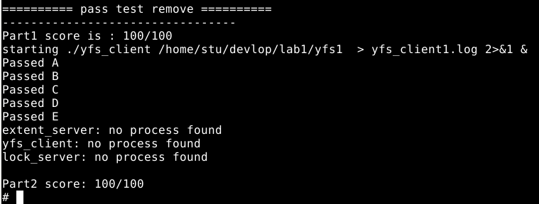
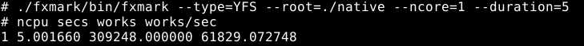
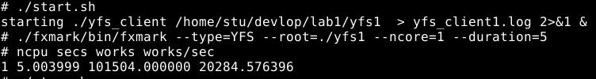

## Lab 1++: Tune Your FS!

### 邓诗羿 518021910184

### 1. 寻找性能瓶颈

#### 1.1. 测试函数

- 测试函数采用intel处理器的rdtsc汇编指令来获取CPU的时钟周期，使用`cat /proc/cpuinfo`查看CPU的主频。测试用机的CPU是i7-8750h，其主频为2208.006MHz。测试函数如下：

  ```c++
  static inline uint64_t get_cycle_count(){
      unsigned int lo, hi;
      __asm__ __volatile__ ("rdtsc" : "=a" (lo), "=d" (hi));
      return ((uint64_t)hi << 32) | lo; 
  }
  ```

#### 1.2. 受测函数

- `yfs_client::create()`：创建文件

- `yfs_client::mkdir()`：创建文件夹

- `yfs_client::lookup()`：在文件夹中查找指定文件或文件夹

- `yfs_client::readdir()`：读取文件夹内容
- `yfs_client::read()`：读取文件内容
- `yfs_client::write()`：写入文件
- `yfs_client::unlink()`：删除指定inode

#### 1.3. 测试结果

```c++
yfs_client::create() time: 9.966477us
yfs_client::mkdir() time: 16.770788us
yfs_client::lookup() time: 3.816121us
yfs_client::readdir() time: 0.962860us
yfs_client::write() time: 25.893951us
yfs_client::unlink() time: 14.271660us
```

#### 1.4. 瓶颈分析

测试中`yfs_client::lookup()`中调用了`yfs_client::readdir()`，因此前者的执行时间总时大于后者，而	在`yfs_client::lookup()`中单独调用`yfs_client::readdir()`就画了2us。因而推测函数调用画了额外的时	间，虽然`yfs_client::readdir()`中调用`printf()`也画了多余的时间。

总体分析下来，`yfs_client::create()`、`yfs_client::write()`和`yfs_client::unlink()`花了绝大部分  	时间。`yfs_client::mkdir()`因为只调用一次，所以不优化也可以。

在以上三个函数中，关于inode层的执行时间都很短，这也是文件操作核心逻辑，因此推测执行时间大部分花在	了函数调用阶段。以`yfs_client::unlink()`执行为例。

```c++
	im::remove():get time:0.105072us
	im::remove():free_direct time:0.971918us
	im::remove():free_indirect time:0.427535us
	im::remove() time:1.504525us
	extent_server::remove() time:9.640372us
	extent_client::remove():p1 time:0.006341us
	extent_client::remove():remove time:11.719171us
	extent_client::remove() time:11.725512us
	yfs::unlink():remove time:24.505368us
	yfs::unlink():get time:0.420289us
	yfs::unlink():iter time:0.454709us
	yfs::unlink():put time:0.697462us
	yfs::unlink() time:29.271660us
```

从上面的log看出，从``inode_manager::remove_file()``到`extent_server::remove()`时间相差8.14us（包括`printf()`的执行时间）。从`extent_client::remove()`到`yfs_client::unlink()`时间相差12.8us（包括`printf()`的执行时间）。由此得出，大部分执行时间花在了函数调用上。

### 2. 性能优化

#### 2.1. 优化方法

- 在`inode_manage`中加入`std::map<uint32_t, int> using_inodes`作为inode的bitmap，使用next fit策略查找空的inode。
- 用索引而不是迭代器遍历vector（没什么用其实）。
- 去掉所有的日志输出，即注释所有的`printf()`。
- `yfs_client::lookup()`中移除`yfs_client::readdir()`，转而直接获取dir的内容，再进行查找。这样不需要将dir内容组织成list再遍历，节约组装和遍历时间。
- 在`yfs_client`中加入`check_type()`返回inode的类型。这样在`fuse.cc`中的`getattr()`中只要调用一次`check_type()`就可以判断类型，不用多次调用`isxx()`函数。
- 在`yfs_client`层加入cache，将对文件的所有操作限制在`yfs_client`层，屏蔽以下的所有层。这么做省去了层与层之间的函数调用，节省了大部分执行时间。

#### 2.2. 优化结果

works per sec 从原来的430左右提升到20000+，性能提升46倍左右。主要是加入cache和去掉`printf()`对性能的提升最大，其余的经过测试和原来的性能差距不大。

### 3. 最终测试结果

- #### 正确性测试

  

- #### native

  

- #### yfs

  

综上所述，本机能够做出的最好比率：yfs/native = 32.8%.